

 <a href="https://himdek.com/Utterly-Round-Plasma-Style/"><h1 align="center">Utterly Round Plasma Theme</h1></a>
 
A rounded Desktop theme and Window borders for Plasma 5 that follows any color scheme

 
 
 
 
 
 
 

  
   
  
  

A round cornered Desktop theme and Window borders for KDE Plasma 5 desktop environment that follows all color scheme with transparency and blur

## Key features:

* Rounded corners for all widget elements
* Follows any color scheme and hence is usable with any Global Themes
* Material You clock widget
* Supports transparency: Go to `System Settings > Workspace Behavior > Desktop Effects` and enable `Blur`, `Background Contrast` and `Tranlucency` for best result.

## Prerequisites:

* Linux based Operating System
* [KDE Plasma 5 Desktop Environment](https://kde.org/plasma-desktop/)

<h1 align="center">Get it from</h1>

<h3 align="center">Plasma Theme</h3>

  
  
  

<h3 align="center">Window Borders</h3>

  
  
  

<h1 id="gallery" align="center">Gallery</h1>

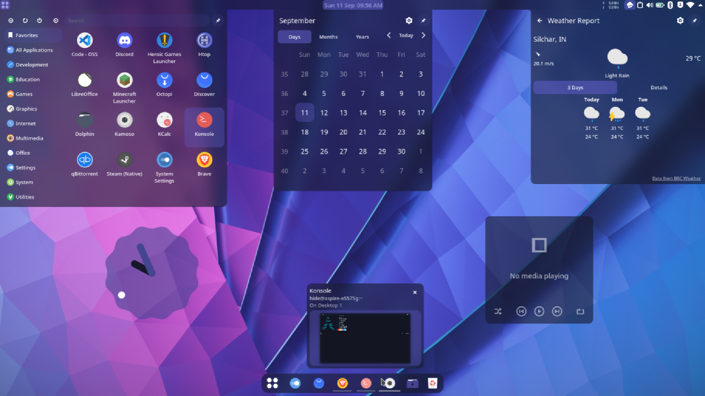
  
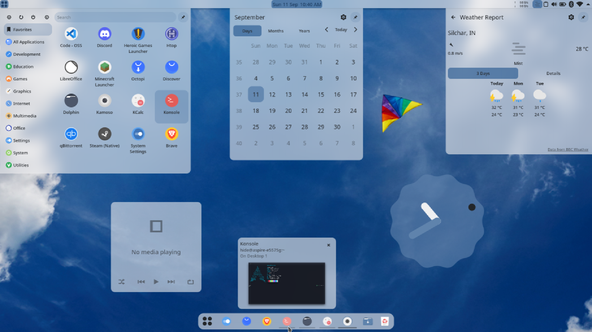
  
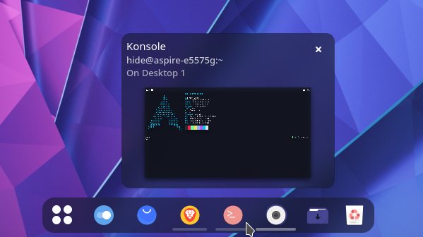
  
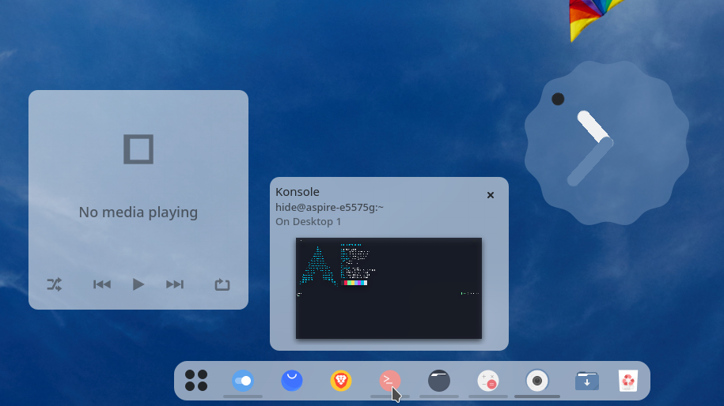
  
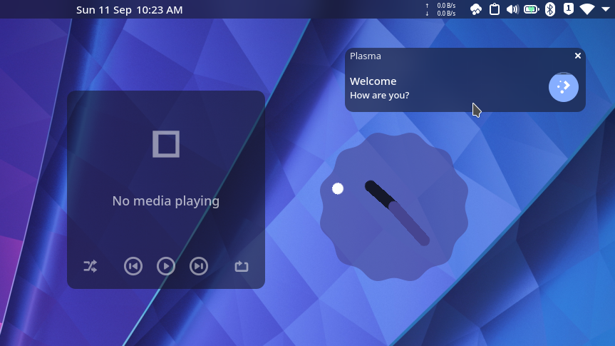

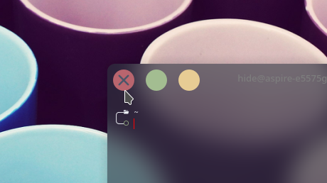
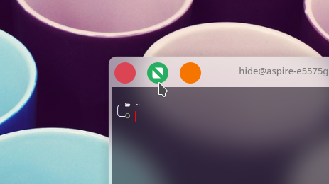
  
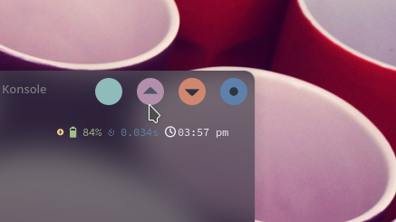
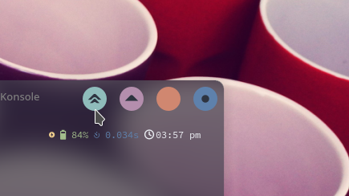
  
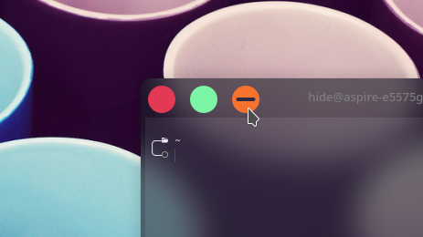
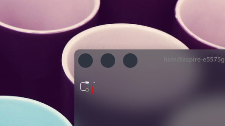

